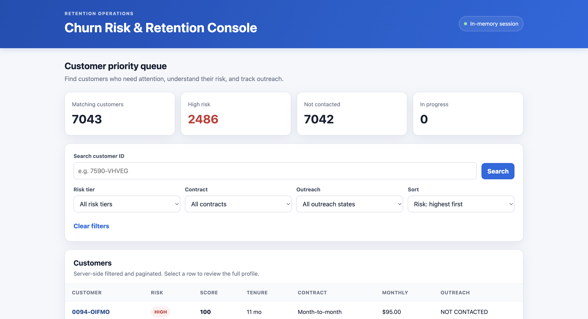
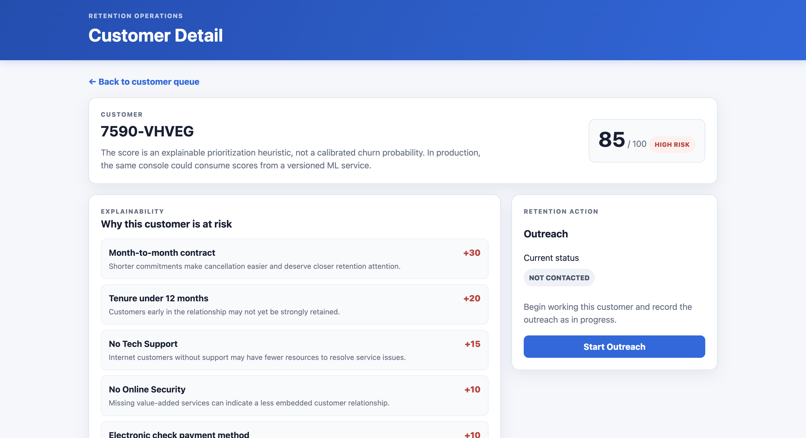

# Churn Risk & Retention Console

A small operational console that turns churn-risk signals into a workflow a retention team can use. The application loads the provided Telco Customer Churn CSV into memory, assigns each customer an explainable heuristic risk score, exposes the data through a Python API, and lets a separate browser client track outreach from **NOT_CONTACTED → IN_PROGRESS → RESOLVED**.

## Screenshots

### Customer Priority Queue



### Customer Detail & Risk Explainability



## Stack

- **Backend:** Python, Flask, Pandas
- **Frontend:** HTML, CSS, vanilla JavaScript (`fetch` API)
- **Tests:** Python `unittest`
- **Data:** company-provided CSV loaded once at application startup; no external database

### Why Flask

Flask is a good fit for this assessment because the backend is a focused HTTP API with a small number of routes and business rules. It keeps routing thin, makes the UI/API boundary explicit, and lets the scoring, outreach validation, and data access code remain framework-independent and easy to test.

### Why vanilla JavaScript

The assessment allows plain HTML/JavaScript as long as it is a genuine separate client. Vanilla JavaScript keeps the dependency surface small while still demonstrating an HTTP client boundary, asynchronous API calls, loading/error states, filtering, pagination, and an operational detail/action flow.

## Repository structure

```text
deai-technical-assessment/
├── data/
│   └── WA_Fn-UseC_-Telco-Customer-Churn.csv
├── backend/
│   ├── app/
│   │   ├── main.py
│   │   ├── routes/
│   │   ├── services/
│   │   └── data_access/
│   ├── tests/
│   └── requirements.txt
├── frontend/
│   ├── index.html
│   ├── customer.html
│   ├── css/
│   └── js/
├── screenshots/
│   ├── dashboard.png
│   └── customer-detail.png
├── .gitignore
└── README.md
```

## Prerequisites

- Python 3.10 or newer

## Run locally

### 1. Confirm the dataset

The assessment's bundled CSV must be at:

```text
data/WA_Fn-UseC_-Telco-Customer-Churn.csv
```

Do not rename or move it.

### 2. Start the backend

From the repository root:

```bash
cd backend
python -m venv .venv
```

Activate the environment:

**macOS/Linux**

```bash
source .venv/bin/activate
```

**Windows PowerShell**

```powershell
.venv\Scripts\Activate.ps1
```

Install dependencies and start the API:

```bash
pip install -r requirements.txt
python -m app.main
```

The API runs at `http://localhost:5000`.

Quick check:

```text
GET http://localhost:5000/health
```

### 3. Start the frontend

Open a second terminal from the repository root:

```bash
cd frontend
python -m http.server 8000
```

Then open:

```text
http://localhost:8000
```

The frontend is intentionally served separately and calls the Flask API over HTTP.

## API

### `GET /customers`

Returns a server-side filtered, sorted, paginated customer list. The complete dataset is never sent to the browser in one response.

Supported query parameters:

| Parameter | Example | Notes |
|---|---|---|
| `page` | `1` | 1-based page number |
| `page_size` | `20` | 1-100 |
| `risk_tier` | `HIGH` | LOW, MEDIUM, HIGH |
| `contract` | `Month-to-month` | Exact contract value |
| `outreach_status` | `NOT_CONTACTED` | NOT_CONTACTED, IN_PROGRESS, RESOLVED |
| `search` | `7590` | Partial customer ID search |
| `sort` | `risk_desc` | risk_desc, risk_asc, monthly_desc, tenure_asc |

Example:

```text
GET /customers?page=1&page_size=20&risk_tier=HIGH&outreach_status=NOT_CONTACTED
```

### `GET /customers/{id}`

Returns the full customer record, risk score/tier, applied risk factors, current outreach status, and the allowed next outreach state.

### `PATCH /customers/{id}/outreach`

Example request:

```json
{
  "status": "IN_PROGRESS"
}
```

Valid progression:

```text
NOT_CONTACTED -> IN_PROGRESS -> RESOLVED
```

A direct `NOT_CONTACTED -> RESOLVED` jump returns HTTP 400. Repeating the current state is treated as an idempotent no-op.

### `GET /model/info`

Returns the heuristic's rules, points, tier thresholds, explanatory note, and outreach state-machine metadata.

## Risk scoring design

The heuristic is intentionally transparent. It is a **prioritization score, not a calibrated churn probability**. The dataset's `Churn` label is displayed as source data but is never used to calculate the risk score.

| Rule | Points |
|---|---:|
| Month-to-month contract | +30 |
| Tenure under 12 months | +20 |
| Tenure 12-23 months | +10 |
| No Tech Support (internet customers only) | +15 |
| No Online Security (internet customers only) | +10 |
| Monthly charges >= $90 | +15 |
| Monthly charges $70-$89.99 | +8 |
| Electronic check payment | +10 |

Only one tenure rule and one monthly-charge rule can apply. The score is capped at 100.

Risk tiers:

```text
LOW      0-34
MEDIUM  35-64
HIGH    65-100
```

### Reasoning

The rules use fields that a retention workflow can explain directly to an agent: commitment level, customer tenure, service/support relationship, price pressure, and payment method. The exact weights are deliberately simple and documented so the console can demonstrate explainability without pretending the heuristic is a trained model.

In a production design, the scoring service could be replaced by a call to a versioned ML endpoint while preserving the console's list/detail/action workflow.

## Data modeling

The CSV is read once during Flask application startup. Each row is converted to a normal Python dictionary and enriched with:

```text
risk_score
risk_tier
risk_factors
outreach_status
```

Customers are keyed by `customerID` for direct lookups. Outreach changes mutate only the in-memory copy, so they persist for the life of the running server and reset when the process restarts, as requested by the assessment.

A `threading.RLock` protects outreach updates because the local Flask server is configured to handle requests with threads.

## Pagination and filtering

Filtering, sorting, and pagination happen on the backend. `GET /customers` first applies the requested filters to the in-memory records, computes summary counts for that filtered set, sorts the result, and then slices only the requested page.

This avoids sending all ~7,000 records to the client and filtering in JavaScript. The current implementation is appropriate for the supplied in-memory exercise. At larger scale, these operations would move to indexed database queries or a dedicated search/read model.

## Error handling and logging

The API returns meaningful status codes:

- **400** for invalid query input, malformed JSON, unknown states, or invalid outreach transitions
- **404** for a missing customer
- **500** for unexpected server failures

CSV load/parsing errors fail fast during startup with a clear message instead of allowing the app to run with incomplete data.

Each HTTP request is logged as a structured JSON message containing the method, path, status code, and request duration. Unexpected failures are logged with stack traces.

The frontend has explicit loading states and visible error messages. A failed API call does not leave a blank table/detail page.

## Parallelism / I/O handling

The runtime workload is intentionally mostly in memory: the CSV is loaded once at startup and normal API requests do not perform file or database I/O. Flask is run with threaded request handling so independent requests can be served concurrently.

On the customer detail page, the frontend requests the customer record and `/model/info` concurrently with `Promise.all` because those are independent HTTP reads.

For a production service that performed network/database I/O per request, I would use a production WSGI server with multiple workers/threads or move I/O-heavy integration work to an async-capable service where appropriate.

## Testing approach

Run from `backend/`:

```bash
python -m unittest discover -s tests -v
```

Coverage includes:

- risk-scoring behavior for high- and low-risk examples
- valid, invalid, and idempotent outreach state transitions
- server-side filtering/pagination on `GET /customers`
- API rejection of an invalid outreach jump

The API tests create a temporary CSV fixture, so tests do not depend on the full assessment dataset.

## Trade-offs made for the assessment

- Outreach is stored in memory rather than a database, matching the requested scope.
- The heuristic is intentionally small and explainable rather than statistically fitted.
- There is no authentication/authorization because it is explicitly out of scope.
- The frontend uses two simple pages instead of introducing a client-side router/framework.
- The contract filter uses known values from the supplied dataset instead of adding a separate metadata endpoint solely for dropdown options.

## With more time

1. Add persistence (for example PostgreSQL) for outreach history, timestamps, notes, and assigned agents.
2. Replace the heuristic with a versioned ML scoring service while keeping factor-level explanations.
3. Add authentication and role-based access for agents and team leads.
4. Add an audit trail for outreach status changes.
5. Add end-to-end browser tests for the list → detail → outreach flow.
6. Add production deployment configuration, health/readiness checks, and operational metrics.
7. Add saved filters / queue ownership for high-volume retention teams.

## Notes

No secrets or API keys are required. Do not commit virtual environments, `node_modules`, build artifacts, or local editor files.
